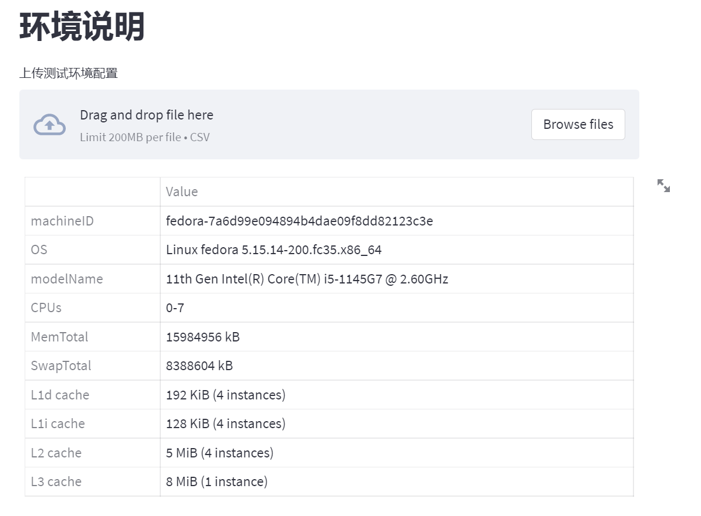
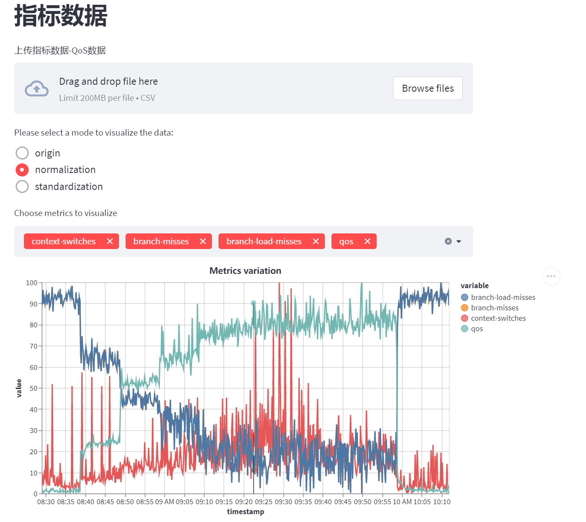
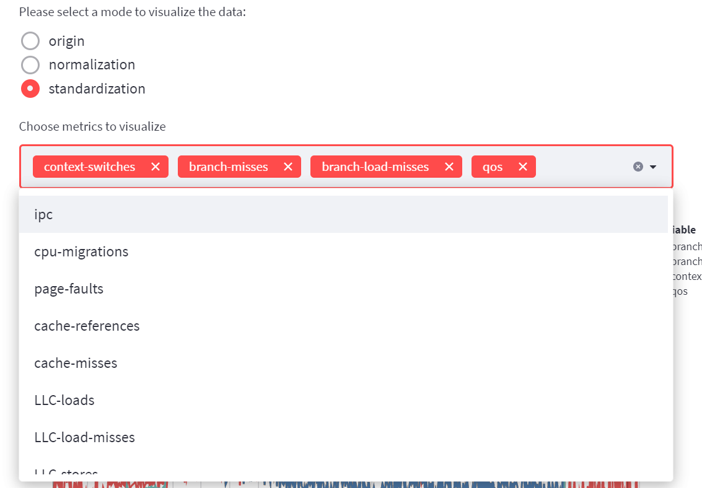
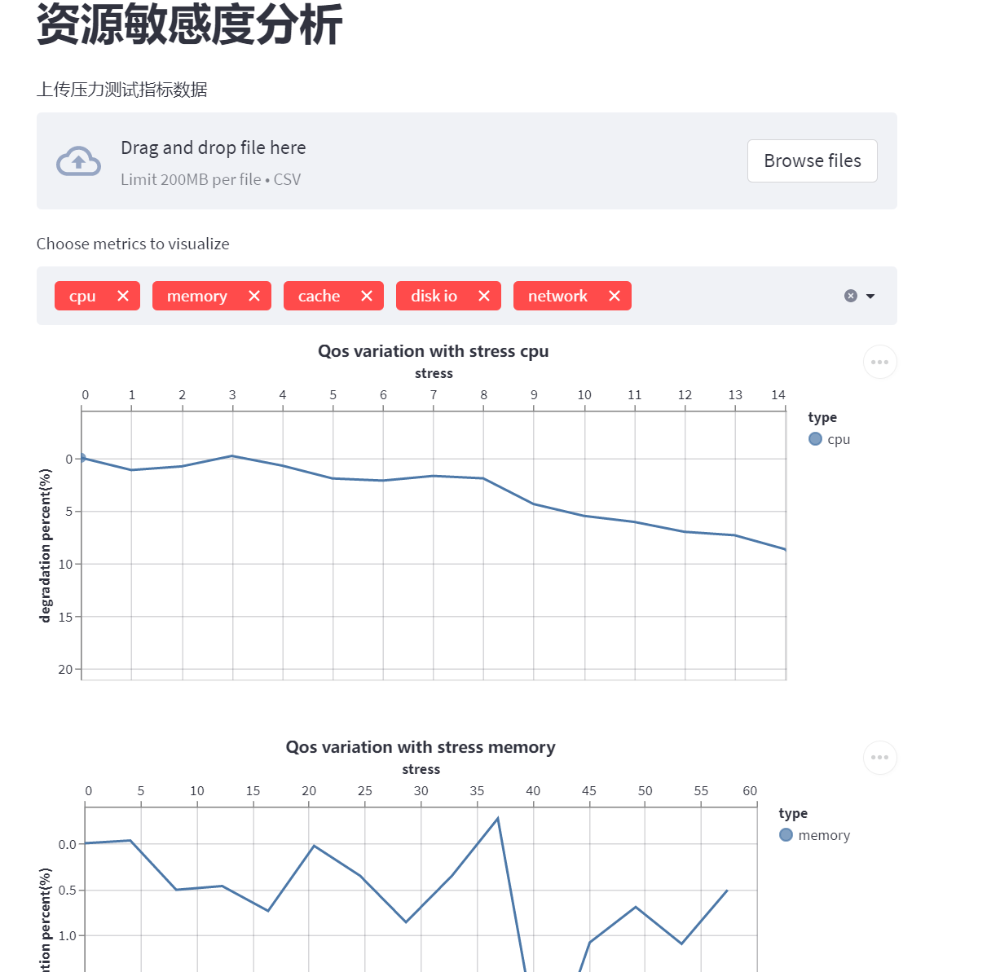
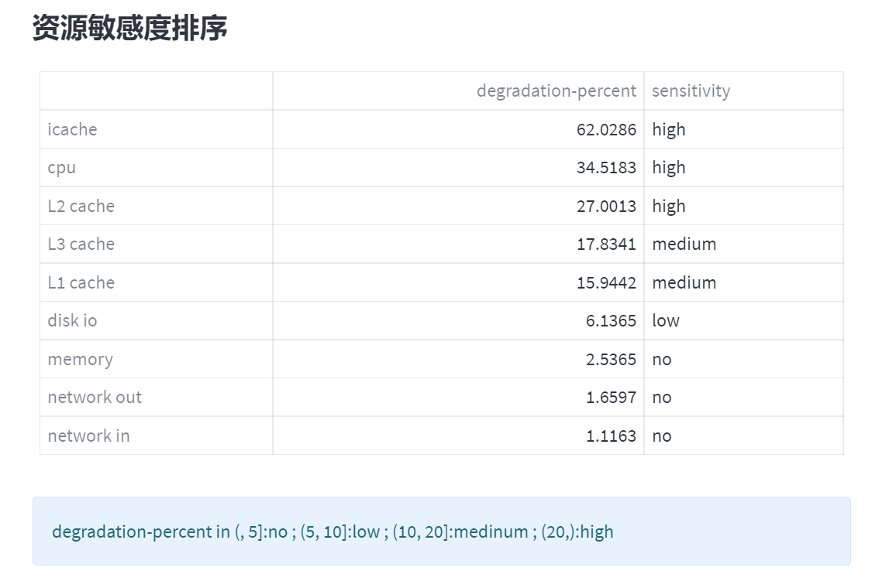
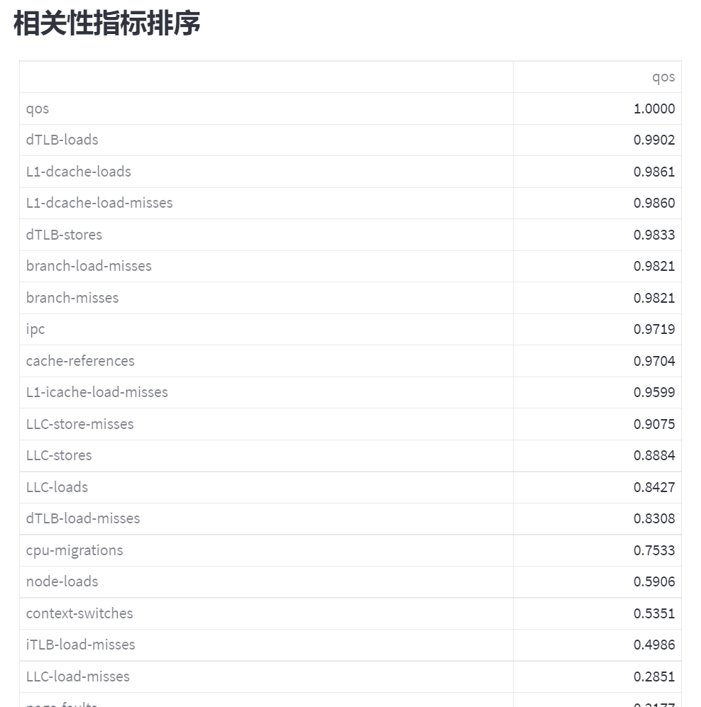
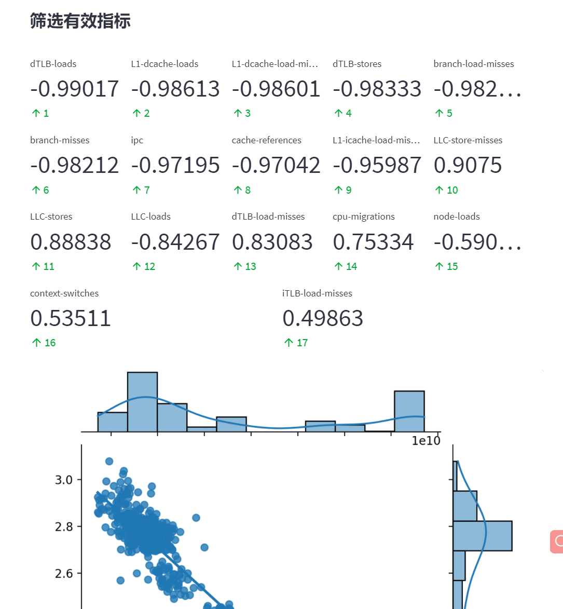
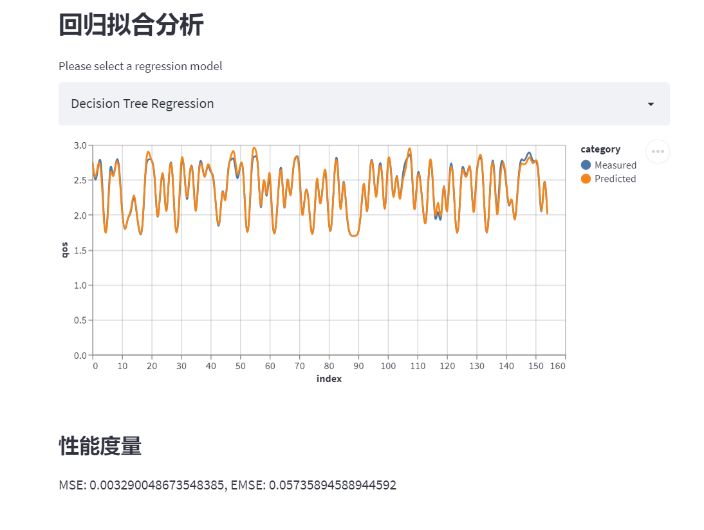

# 操作书册

## 准备工作

1. 安装和配置python环境，此处不详细展开

2. 安装依赖库
```bash
$ pip install -r requirements.txt
```

3. 启动并运行
```bash
$ cd rubikanalysis
$ streamlit run analysis.py

  You can now view your Streamlit app in your browser.

  Network URL: http://xx.xx.xx.xx:8501
  External URL: http://xx.xx.xx.xx:8501
```

打开浏览器，输入`Network URL`，进入`混部干扰建模分析工具`界面

## 使用

混部干扰建模分析工具，主要包括业务介绍、环境说明、指标数据、资源敏感度分析、相关性分析等几个部分。分析工具默认会使用`tests/data/`中的数据进行分析，用户可以上传自己采集到的数据，由分析工具帮助分析，但需保证数据的格式满足工具的格式要求。

### 环境说明

主要展示测试环境的情况，数据格式如下所示。

```
Item,Value
machineID,fedora-7a6d99e094894b4dae09f8dd82123c3e
OS,Linux fedora 5.15.14-200.fc35.x86_64
modelName,11th Gen Intel(R) Core(TM) i5-1145G7 @ 2.60GHz
CPUs,0-7
MemTotal,15984956 kB
SwapTotal,8388604 kB
L1d cache,192 KiB (4 instances)
L1i cache,128 KiB (4 instances)
```

点击`Browse files`并选择数据文件


结果展示


### 指标数据

主要展示各种指标随timestamp的变化趋势，数据格式如下所示

```
timestamp,context-switches,branch-misses,branch-load-misses,ipc,cpu-migrations,page-faults,cache-references,cache-misses,LLC-loads,LLC-load-misses,LLC-stores,LLC-store-misses,L1-dcache-loads,L1-dcache-load-misses,L1-icache-load-misses,dTLB-load-misses,dTLB-loads,dTLB-store-misses,dTLB-stores,iTLB-load-misses,node-load-misses,node-loads,qos
2022-03-09 08:29:01,384,29086876,29067390,2.68,103,3295,156126454,58757176,7789949,4451332,23809342,19897695,12536872348,243692903,33757849,359147,13660089049,563717,4755805513,551421,0,4354843,1.69833
2022-03-09 08:29:11,384,28395073,28400706,2.61,145,6309,155585113,58593036,8153357,4354526,24442693,20019110,12577306341,248034851,34849021,399561,13591777510,611925,4758125952,537069,0,4322310,1.70167
2022-03-09 08:29:21,412,29354478,29364502,2.67,115,2608,157103650,59814473,7803900,4471600,23391664,19518910,12836532172,251846933,33950272,364048,13601421822,550633,4796035193,639177,0,4471451,1.687
2022-03-09 08:29:31,395,28489483,28484761,2.65,103,4421,154754165,58395113,7701376,4373529,23916706,19828115,12895017688,253549460,34322874,378664,13634078821,539258,4785515079,569687,0,4393632,1.68833
2022-03-09 08:29:41,427,28812242,28823944,2.66,121,8171,154372987,57059560,7729852,4404123,23329895,19700263,12841223403,251193277,34617487,379189,13534862954,625461,4776076428,554582,0,4382613,1.69933
2022-03-09 08:29:51,415,28488720,28504048,2.64,95,2784,154949447,57995354,7851246,4471877,26459658,21443114,12757691754,254019307,33986802,391915,13579880550,557936,4747949552,567421,0,4457386,1.69933
```

结果展示


可以选择展示数据是原始(origin)、规范化(normalization)或者标准化(standardization)，同时，用户也可以选择需要展示的指标



### 资源敏感度分析

主要展示各种压力测试下，业务QoS的变化情况，从而说明业务的资源敏感性情况。数据格式如下所示

```
type,stress,avg-qos,degradation-percent
none,0,10.86497,0.0
cpu,1,10.99181,1.1674215
cpu,2,10.95385,0.8180418
cpu,3,10.84609,-0.1737695
cpu,4,10.94601,0.7458833
memory,4.1,10.8617,-0.0300967
memory,8.2,10.92014,0.5077787
memory,12.3,10.91567,0.4666373
memory,16.4,10.9452,0.7384282
L1 cache,1,10.87615,0.1028995
L1 cache,2,11.34648,4.431765599999999
L1 cache,3,11.08431,2.0187815000000002
L1 cache,4,10.98052,1.0635096
```

结果展示


根据资源敏感度分析进行排序


### 相关性分析

分析业务QoS和各个指标的相关性，使用的数据即为`指标数据`中上传的数据

热力图分析结果，颜色越浅代表约正相关，颜色越深代表越负相关


相关性指标排序结果，此处是按照绝对值进行排序，|r|>0.95存在显著性相关;|r|≥0.8高度相关;0.5≤|r|<0.8 中度相关;0.3≤|r|<0.5低度相关;|r|<0.3关系极弱


筛选有效指标结果，选出所有相关性较高的指标，并绘制该指标与QoS的散点图


回归拟合分析结果，可以选择不同的回归模型，绘制测量值以及回归拟合后的预测值的对比图。同时计算出MSE（Mean Square Error）均方误差以及RMSE（Root Mean Square Error）均方根误差
